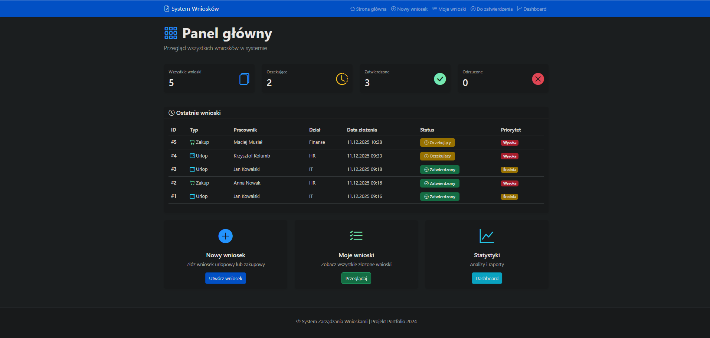

# System Zarządzania Wnioskami

Aplikacja webowa do zarządzania wnioskami urlopowymi i zakupowymi z workflow zatwierdzającym.

## 🚀 Technologie

- **Backend:** Python 3.14, Flask 3.0
- **Baza danych:** SQLite + SQLAlchemy ORM
- **Frontend:** Bootstrap 5, Chart.js
- **Template Engine:** Jinja2

## 📋 Funkcjonalności

✅ Formularze zgłoszeniowe (urlop/zakup)
✅ Dynamiczne pola w zależności od typu wniosku
✅ System zatwierdzania wielopoziomowy
✅ Dashboard ze statystykami i wykresami
✅ Filtrowanie i sortowanie wniosków
✅ Powiadomienia email (symulacja)
✅ Responsywny design

## 🔧 Instalacja

1. Sklonuj repozytorium
2. Zainstaluj zależności:
```bash
py -m pip install -r requirements.txt
```
3. Uruchom aplikację:
```bash
py app.py
```
4. Otwórz: http://localhost:5000

## 📸 Screenshots



## 📂 Struktura projektu
```
request-management-system/
├── app.py              # Główna aplikacja
├── config.py           # Konfiguracja
├── database.db         # Baza SQLite
├── requirements.txt    # Zależności
└── templates/          # Szablony HTML
```
